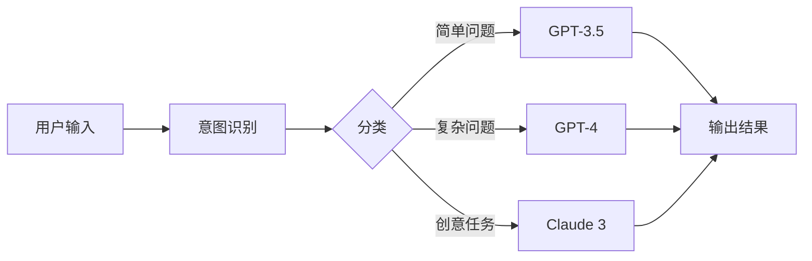

# Dify 插件

API易 为 Dify 平台提供了专门的插件，让您能够更方便地在 Dify 中使用我们的 AI 模型服务。

## 什么是 Dify？

Dify 是一个开源的 LLM 应用开发平台，它可以帮助您：

- 🚀 快速搭建 AI 应用
- 🔧 可视化编排 Prompt
- 📊 管理数据集和知识库
- 🤖 创建 AI Agent
- 🔄 设计复杂的工作流

## 插件优势

使用 API易 Dify 插件的优势：

### 1. 一键配置
- 无需手动配置 API 地址
- 自动识别模型列表
- 简化认证流程

### 2. 模型丰富
- 支持所有 API易 提供的模型
- 自动同步最新模型
- 统一的调用接口

### 3. 成本优化
- 统一计费管理
- 实时费用监控
- 智能路由选择

## 安装方式

### 方法一：通过 Dify 应用商店

1. 登录 Dify 平台
2. 进入"插件市场"
3. 搜索"API易"或"APIYi"
4. 点击"安装"

### 方法二：手动安装

1. 下载插件文件
2. 在 Dify 中进入"插件管理"
3. 点击"上传插件"
4. 选择下载的插件文件

## 配置步骤

### 1. 获取 API 密钥

首先在 [API易控制台](https://vip.apiyi.com) 获取您的 API 密钥。

### 2. 配置插件

安装插件后，进行配置：

1. 在 Dify 中打开"插件设置"
2. 找到"API易"插件
3. 输入您的 API 密钥
4. 点击"保存"

### 3. 验证连接

配置完成后，测试连接：

1. 点击"测试连接"
2. 查看是否显示"连接成功"
3. 检查模型列表是否正常加载

## 使用方法

### 在对话应用中使用

1. 创建新的对话应用
2. 在模型选择中选择"API易"
3. 选择具体的模型（如 GPT-4、Claude 3）
4. 开始构建您的应用

### 在工作流中使用

1. 创建工作流
2. 拖入"LLM"节点
3. 选择"API易"作为提供商
4. 配置模型和参数

### 在知识库中使用

1. 创建知识库
2. 在嵌入模型中选择"API易"
3. 选择嵌入模型（如 text-embedding-ada-002）
4. 上传文档开始索引

## 高级功能

### 1. 模型参数配置

插件支持完整的模型参数配置：

```yaml
temperature: 0.7      # 创造性控制
max_tokens: 2000     # 最大输出长度
top_p: 0.9          # 核采样
frequency_penalty: 0 # 频率惩罚
presence_penalty: 0  # 存在惩罚
```

### 2. 多模型切换

在同一个应用中灵活切换不同模型：

- 开发阶段使用 GPT-3.5（成本低）
- 生产环境使用 GPT-4（效果好）
- 特定任务使用专门模型

### 3. 流式输出

插件默认支持流式输出，提供更好的用户体验：

- 实时显示生成内容
- 减少用户等待时间
- 支持中断生成

### 4. 错误处理

智能的错误处理机制：

- 自动重试失败请求
- 模型降级策略
- 详细的错误日志

## 最佳实践

### 1. 模型选择策略

根据不同场景选择合适的模型：

| 场景 | 推荐模型 | 原因 |
|------|---------|------|
| 客服对话 | GPT-3.5-Turbo | 响应快、成本低 |
| 内容创作 | Claude 3 | 创造力强、文笔好 |
| 代码生成 | GPT-4 | 逻辑准确、质量高 |
| 数据分析 | GPT-4 | 推理能力强 |

### 2. Prompt 优化

使用 Dify 的 Prompt 编排功能：

```text
系统提示词:
你是一个专业的 {{role}}，具有以下特点：
- 专业领域：{{domain}}
- 回答风格：{{style}}
- 语言要求：{{language}}

用户输入：{{query}}

请根据以上要求回答用户问题。
```

### 3. 知识库集成

结合知识库提升回答质量：

1. 上传相关文档到知识库
2. 在 Prompt 中引用知识库
3. 让 AI 基于知识库回答

### 4. 工作流设计

构建高效的 AI 工作流：



## 常见问题

### 插件无法连接

**检查事项：**
1. API 密钥是否正确
2. 账户余额是否充足
3. 网络连接是否正常

### 模型列表为空

**解决方法：**
1. 刷新插件配置
2. 重新输入 API 密钥
3. 检查插件版本

### 响应速度慢

**优化建议：**
1. 选择更快的模型
2. 减少输出长度
3. 使用流式输出

### 成本控制

**省钱技巧：**
1. 开发时用便宜模型
2. 设置 max_tokens 限制
3. 使用缓存功能

## 更新日志

### v1.2.0 (最新)
- 支持 Claude 3.5 Sonnet
- 优化流式输出性能
- 添加自动重试机制

### v1.1.0
- 支持 GPT-4 Turbo
- 添加模型使用统计
- 修复已知问题

### v1.0.0
- 初始版本发布
- 支持主流模型
- 基础功能实现

## 获取支持

遇到问题？我们提供多种支持方式：

<CardGroup cols={2}>
  <Card title="文档中心" icon="book" href="/api-reference/integrations/dify">
    查看详细的 Dify 集成文档
  </Card>
  
  <Card title="技术支持" icon="headset" href="mailto:support@apiyi.com">
    联系我们的技术支持团队
  </Card>
  
  <Card title="社区讨论" icon="users" href="https://api.apiyi.com">
    加入社区讨论和交流
  </Card>
  
  <Card title="视频教程" icon="play" href="#">
    观看视频教程学习使用
  </Card>
</CardGroup>

<Note>
API易 Dify 插件持续更新中，请关注最新版本获取新功能。
</Note>